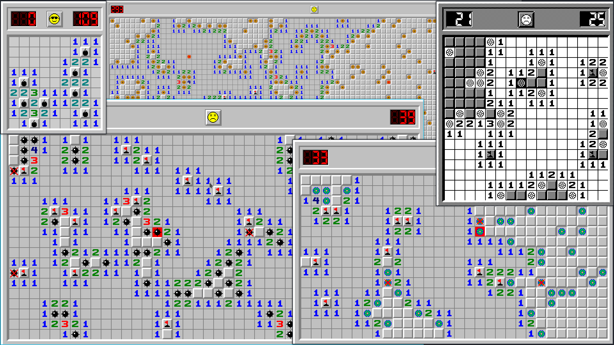

# Minesweeper (C - SDL2)
Uncover all non mine/flower tiles to win. Left click on a square to uncover it. Right click on a tile to mark it as a mine or with a question mark. These marks are purely for the user keep track of mines or unknown squares. They prevent that tile being uncovered by a left click. The top left number is the number of mines on the board minus the number of flags placed. The top right number is the elapsed time. Any numbered square holds the number of how many mines are immediately touching that square. The first turn may not end the game in a win or lose situation.

# Build
To build the binary you will need all required build tools needed to compile via Makefile and gcc. You will also need SDL2, SDL2_image and SDL2_ttf both the libraries and headerfiles.

## ArchLinux instructions.

    sudo pacman -S --needed base-devel
    sudo pacman -S --needed sdl2 sdl2_image sdl2_ttf
    make release run

# Controls
1 through 8 - Change the theme of the game.\
Q, W, E, R, T - Change size from Tiny to Huge.\
A, S, D, F - Change difficulty from Easy to Very Hard\
Left Click on tile to uncover.\
Left Clock on Face to reset.\
Right Click on tile to mark.\
P - Enables showFPS.\
Escape - Quits
